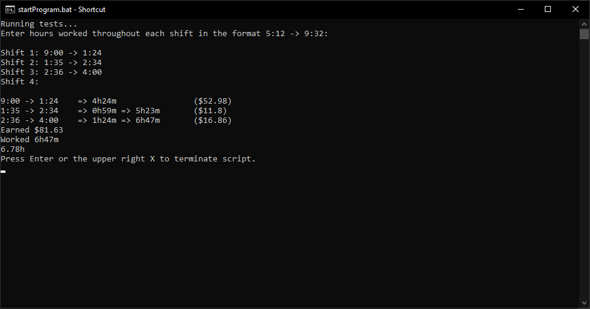

# TimesheetCalculator

Helps me calculate the hours I work into formatted hours, minutes, and totals.

Usage: Either run ``startProgram.bat`` or run ``main.py``, then type all of the shifts you worked in the format ``hh:mm -> hh:mm``. Once you're done entering each shift, press enter again.

``:`` and ``>`` are interchangable with ``;`` and ``.`` due to a faulty keyboard.

Note that this only works with hours 1 -> 12, it is not compatible with 24h.
